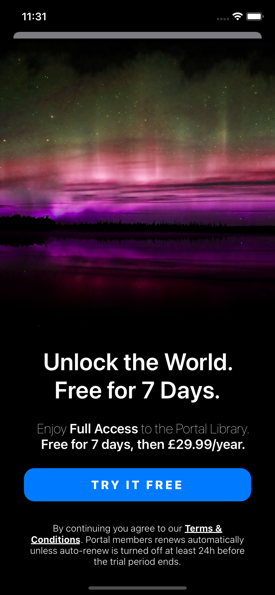

# Portal App Paywall Screen Layout in Code

 
The necessary paywall screen design for purchase within the application.

### Screenshots:
 

### Used Technologies:
- Snapkit: https://github.com/SnapKit/SnapKit 
- BonMot: https://github.com/Rightpoint/BonMot
- Stack View
- Auto Layout
- Gradient View
- Custom Button
- Custom Background View

### Features:
- Paywall Screen

### Requirements:
- Xcode 13+
- Swift 5+
- iOS 12+
